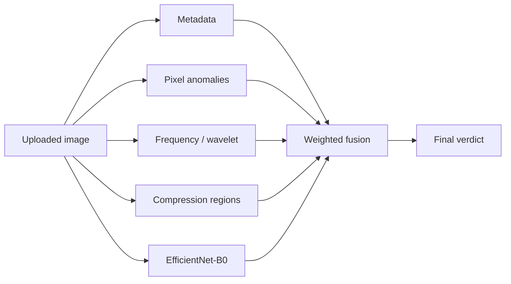

# DetectingPhoto

A full-stack web application for uploading images and verifying whether an image is likely original or morphed/manipulated. The frontend is built with React + Vite; the backend is a FastAPI service that runs a multi-signal forensic analysis pipeline.

---

## Prerequisites

- **Node.js** 18+ and npm
- **Python** 3.10+
- (Optional) CUDA-capable GPU for faster ML inference

---

## How to Run

### 1. Backend

```powershell
cd backend
python -m venv .venv
.venv\Scripts\activate        # macOS/Linux: source .venv/bin/activate
pip install -r requirements.txt
python scripts/download_weights.py
python -m uvicorn main:app --reload --host 127.0.0.1 --port 8000
```

The API will be available at `http://127.0.0.1:8000`.

| Endpoint | Method | Description |
|----------|--------|-------------|
| `/health` | GET | Health check |
| `/api/upload` | POST | Upload an image (multipart field: `photo`) |
| `/api/verify` | POST | Verify an image for morphing (multipart field: `photo`) |

Interactive API docs: `http://127.0.0.1:8000/docs`

### 2. Frontend

In a separate terminal:

```powershell
npm install
npm run dev
```

Open `http://localhost:5173`. The Vite dev server proxies `/api/*` requests to the backend at port 8000.

### 3. Using the UI

1. Click **Choose photo** and select an image (max 5 MB).
2. Click **Verify image** to run morph detection and view per-check results.
3. Click **Confirm upload** to save the file to `backend/uploads/`.

### 4. Production build

```powershell
npm run build
npm run preview
```

---

## Image Verification — Implementation Details

The verification endpoint (`POST /api/verify`) accepts an image upload and returns a structured verdict:

```json
{
  "verdict": "likely_morphed | likely_original | inconclusive",
  "confidence": 0.0,
  "morph_score": 0.0,
  "checks": { ... }
}
```

Each check produces a **morph score** from `0.0` (likely original) to `1.0` (likely morphed), a list of **flags**, and supporting **details**. The orchestrator in `backend/services/verification.py` runs all five checks in parallel, fuses their scores with fixed weights, and maps the result to a final verdict.



### Score fusion weights

| Check | Weight | Rationale |
|-------|--------|-----------|
| ML model | 0.35 | Learns complex manipulation patterns from data |
| Compression regions | 0.20 | Strong signal for splicing/copy-move in JPEGs |
| Frequency analysis | 0.20 | Detects periodic and boundary artifacts |
| Pixel anomalies | 0.15 | Catches local noise/statistical inconsistencies |
| Metadata | 0.10 | Useful but easily stripped; lowest weight |

**Verdict thresholds:** `morph_score >= 0.65` → `likely_morphed`; `<= 0.35` → `likely_original`; otherwise `inconclusive`.

**Confidence:** `1 - std(active_scores)` — higher agreement across checks yields higher confidence.

If the ML model weights are unavailable, its weight is dropped and the remaining checks are renormalized.

---

### 1. Metadata analysis

**Module:** `backend/detectors/metadata.py`

**What it does:** Extracts EXIF metadata (software, camera make/model, timestamps, orientation, GPS, embedded thumbnail) and flags inconsistencies.

**Flags raised:**
- Editing software detected (Photoshop, GIMP, Lightroom, etc.)
- JPEG with no EXIF on a large image (possible re-export)
- `DateTime` vs `DateTimeOriginal` mismatch
- Embedded thumbnail dimensions differ from the image
- Non-default EXIF orientation tag present

**Why this step:** EXIF data is written by cameras and editing tools at capture or save time. Tampered images often pass through editors that leave software tags, strip metadata, or produce timestamp/thumbnail inconsistencies. Metadata analysis is fast and requires no pixel processing, making it a low-cost first signal.

**References:**
- [EXIF — Exchangeable image file format (Wikipedia)](https://en.wikipedia.org/wiki/Exif)
- [JPEG metadata and forensic analysis overview (Forensic Focus)](https://www.forensicfocus.com/articles/metadata-forensics-digital-images/)
- [piexif library documentation](https://piexif.readthedocs.io/en/latest/)

---

### 2. Pixel anomaly detection

**Module:** `backend/detectors/pixel_stats.py`

**What it does:** Converts the image to grayscale, divides it into 32×32 blocks, and for each block computes:
- **Noise residual variance** via Laplacian high-pass filtering
- **Histogram entropy**
- **Local standard deviation**

Blocks whose metrics deviate more than 2σ from the image median are marked anomalous. The score combines the fraction of anomalous blocks with the coefficient of variation of block-level noise.

**Why this step:** When regions from different sources are spliced or copy-moved into an image, they often carry different sensor noise patterns, compression histories, or statistical properties. Comparing local noise and entropy across blocks is a well-established passive forensic technique that does not require knowledge of the original camera.

**References:**
- [Noiseprint: a CNN-based camera model fingerprint (arXiv)](https://arxiv.org/abs/1808.08396)
- [Overview of noise-based forgery detection (ScienceDirect)](https://www.sciencedirect.com/science/article/abs/pii/S0165168412000731)
- [OpenCV Laplacian operator documentation](https://docs.opencv.org/4.x/d4/d86/group__imgproc__filter.html)

---

### 3. Frequency and wavelet analysis

**Module:** `backend/detectors/frequency.py`

**What it does:**
- **FFT (Fast Fourier Transform):** Computes the 2D magnitude spectrum and measures energy ratio between inner and outer frequency bands. Unnatural periodic peaks can indicate copy-paste grid artifacts.
- **DWT (Discrete Wavelet Transform, Daubechies-4, 2 levels):** Compares high-frequency coefficient energy at grid cell boundaries vs. interior regions. Blended splice boundaries often show elevated high-frequency energy at seams.
- **Edge discontinuity:** Applies Canny edge detection and Sobel gradient analysis to measure inconsistent edge strength across the image.

**Why this step:** Manipulation operations (copy-move, splicing, cloning, blending) disturb the natural frequency content of an image. Periodic patterns appear in the Fourier domain when repeated blocks are pasted, and wavelet decomposition localizes abrupt transitions at splice boundaries that are invisible to the naked eye.

**References:**
- [Copy-move forgery detection using DCT/FFT (IEEE)](https://ieeexplore.ieee.org/document/4167412)
- [Wavelet-based image forgery detection survey (Springer)](https://link.springer.com/article/10.1007/s11042-019-08664-7)
- [NumPy FFT documentation](https://numpy.org/doc/stable/reference/routines.fft.html)
- [PyWavelets documentation](https://pywavelets.readthedocs.io/en/latest/)

---

### 4. Regional compression analysis (ELA)

**Module:** `backend/detectors/compression.py`

**What it does:**
- Performs **Error Level Analysis (ELA):** re-saves the image as JPEG at a fixed quality (90) and computes the per-pixel difference from the original. Regions compressed at different quality levels show different error magnitudes.
- Divides the ELA map into a 4×4 grid and compares mean error levels between adjacent cells.
- Flags large adjacent-cell ELA ratios and high coefficient of variation across the grid.

Non-JPEG inputs are converted to JPEG in-memory before ELA (noted in the response details).

**Why this step:** JPEG compression is lossy and leaves a characteristic error signature. When parts of an image come from different sources (each compressed at a different quality), the error levels are inconsistent across regions. ELA is one of the most widely used single-image forensic techniques for detecting splicing and re-compression.

**References:**
- [Error Level Analysis — original explanation by Neal Krawetz](http://www.infosecblog.org/2007/09/23/error-level-analysis-in-images/)
- [ELA-based forgery detection overview (FotoForensics)](https://fotoforensics.com/tutorial-ela.php)
- [JPEG compression and re-compression artifacts (Wikipedia)](https://en.wikipedia.org/wiki/JPEG#Effects_of_JPEG_compression)

---

### 5. ML model (EfficientNet-B0)

**Module:** `backend/detectors/ml_model.py`

**What it does:**
- Loads an **EfficientNet-B0** binary classifier (`original` vs `morphed`) via the `timm` library.
- Preprocesses the image to 224×224 with ImageNet normalization.
- Runs inference and returns the softmax probability of the `morphed` class.
- Weights are loaded lazily on the first request from `backend/weights/efficientnet_b0_forgery.pth`.

**Setup script:** `python scripts/download_weights.py` creates the weights file using an ImageNet-pretrained backbone with a fresh binary head. For production accuracy, replace this file with weights fine-tuned on forgery datasets (e.g., CASIA, CoMoFoD).

**Why EfficientNet-B0:** EfficientNet uses compound scaling (depth, width, resolution) to achieve strong accuracy with fewer parameters than ResNet or VGG at the same FLOPs budget. This makes it practical for CPU inference in a web API while still capturing high-level manipulation artifacts that hand-crafted features miss. Transfer learning from ImageNet pretraining provides rich visual features that can be adapted to forgery detection with fine-tuning.

**References:**
- [EfficientNet: Rethinking Model Scaling for CNNs (arXiv)](https://arxiv.org/abs/1905.11946)
- [Transfer learning for image forgery detection (ACM)](https://doi.org/10.1145/3633284)
- [timm library — PyTorch Image Models](https://github.com/huggingface/pytorch-image-models)
- [CASIA Image Tampering Detection dataset](https://github.com/namtpham/casia2groundtruth)

---

## Project structure (verification-related)

```
backend/
├── main.py                     # POST /api/verify endpoint
├── detectors/
│   ├── metadata.py             # EXIF inconsistency checks
│   ├── pixel_stats.py          # Block-level noise/entropy anomalies
│   ├── frequency.py              # FFT + wavelet + edge analysis
│   ├── compression.py          # Regional ELA
│   └── ml_model.py             # EfficientNet-B0 classifier
├── services/
│   └── verification.py         # Parallel orchestration + score fusion
├── schemas/
│   └── verification.py         # Pydantic response models
├── scripts/
│   └── download_weights.py     # ML weight setup
└── weights/                    # Gitignored model checkpoint
```

---

## Limitations

- **Metadata** can be intentionally stripped; it is a weak signal on its own.
- **ELA** is most effective on JPEG images; PNG/WebP are converted before analysis.
- **ML model** accuracy depends on how similar the input is to the training data. The default weights use an ImageNet backbone with an untrained head — replace with fine-tuned forgery weights for reliable ML scores.
- **Heuristic checks** are probabilistic and should be interpreted as risk indicators, not legal proof of tampering.
- First verification request after server start incurs model load time (~2–6 s on CPU).
